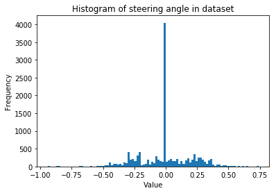
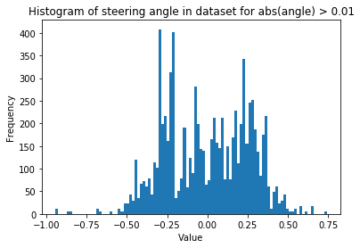

# CarND-Term Project 3

## Introduction

In this project, we are required to train a model that can drive a car in a simulator.

## Model Architecture

### Design

I decide to use the [Nvidia's Architecture](http://images.nvidia.com/content/tegra/automotive/images/2016/solutions/pdf/end-to-end-dl-using-px.pdf) as the begining point.
This architecture contains 1 normalization layer, 5 convolutional layers and 4 fully-conntected layer.

There is no dropout layers described in the articles. A dropout layer can reduce overfitting of the model. 
Firstly, I add 3 dropout layers between convolutional layers. 
However, 3 dropout layers seems too much for my model. After training, the model predict always a constant number regardless the pictures. 
After study the VGG16 structure, I decide add the dropout layer at the end with the rate 0.5.

The Nvidia's network accept images 66x200, our images size is 160x320.
I need to adjust the parameters to fit our image size. 
As I don't have enough experience on these parameters like kernal size and feature size, I consult models as AlexNet, VGG16, 
try the parameters they use and test them in experienment. 
Finally, I reduced it to 4 convolutional layers + 4 fully-conntected layers as the performance are similar.
The car is able to drive on itself and make 3 to 5 turns.

### Structure

   160 x 320 x 3
-> BatchNormalization

-> Convolution2D (kernal=11 stride=2) -> 75 x 155 x 40 -> Relu
-> MaxPolling2D (stride = 2)          -> 37 x 77 x 40

-> Convolution2D (kernal=7 stride=2)  -> 16 x 36 x 60  -> Relu
-> MaxPolling2D(stride = 2)           -> 8 x 18 x 60

-> Convolution2D (kernal=3)           -> 6 x 16 x 80   -> Relu

-> Convolution2D (kernal=(3, 1))      -> 4 x 16 x 110  -> Relu 

-> Flatten 7040
-> Dropout(0.5)

-> Dense 1000 -> Relu
-> Dense 200 -> Relu
-> Dense 50 -> Relu
-> Dense 10 -> Relu
-> Dense 1

## Model Training

### Data collection

1. I record my normal driving of 20 laps 
2. Selective recording. For teaching the car to drive back to the center of lane, 
   I did the following: Disable the recorder, drive car off-lane, turn on the recorder, 
   record images that I drive the car back to center. This procedure is also applyed 
   in different terrain, dirt, glass, red and write border.

Finally, I collected 35398 records. The time different between each record is 0.1 second.
Thus, the total data set is 1 hour driving.

### Data Overview

### Steering angle shift

Because in the autonomous, the app receive an image then send the steering data. During several experienment, I find that
the vehicule sometimes turned too late.
So In the training, I decide modify the data. Based on the processing time of my model, I do the shifting bellow:
A image's correspond steering = 1/2 * (this moment angle + next moment angle (0.1s later))

### Reinforce big turned

The training data mainly composed by straight driving data. To train more on turning, I duplicate the training data for 
steering_angle > 0.2, 5 times.

### Using of Left and Right camera

To improve the model's robustness, I use the left camera image and right camera image. 
I add(minus) 0.045 steering angle for left(right) images, use these images to train the car go back when it get deviated.

### Validation set

data is split as 4:1 for training and validation

### Traing process 

The following data is an example for one of the training.

Epoch 1/20
116424/116367 [==============================] - 406s - loss: 0.0092 - val_loss: 0.0080                                            0.0065
Epoch 2/20
116424/116367 [==============================] - 412s - loss: 0.0069 - val_loss: 0.0062
Epoch 3/20
116424/116367 [==============================] - 409s - loss: 0.0060 - val_loss: 0.0054
Epoch 4/20
116424/116367 [==============================] - 406s - loss: 0.0053 - val_loss: 0.0052
Epoch 5/20
116424/116367 [==============================] - 406s - loss: 0.0048 - val_loss: 0.0049
Epoch 6/20
116424/116367 [==============================] - 401s - loss: 0.0043 - val_loss: 0.0045
Epoch 7/20
116424/116367 [==============================] - 403s - loss: 0.0039 - val_loss: 0.0041
Epoch 8/20
116424/116367 [==============================] - 392s - loss: 0.0034 - val_loss: 0.0038
Epoch 9/20
116424/116367 [==============================] - 392s - loss: 0.0031 - val_loss: 0.0034
Epoch 10/20
116424/116367 [==============================] - 397s - loss: 0.0028 - val_loss: 0.0033
Epoch 11/20
116424/116367 [==============================] - 392s - loss: 0.0026 - val_loss: 0.0030
Epoch 12/20
116424/116367 [==============================] - 389s - loss: 0.0024 - val_loss: 0.0030
Epoch 13/20
116424/116367 [==============================] - 392s - loss: 0.0022 - val_loss: 0.0028
Epoch 14/20
116424/116367 [==============================] - 393s - loss: 0.0021 - val_loss: 0.0027
Epoch 15/20
116424/116367 [==============================] - 397s - loss: 0.0018 - val_loss: 0.0026
Epoch 16/20
116424/116367 [==============================] - 392s - loss: 0.0018 - val_loss: 0.0024
Epoch 17/20
116424/116367 [==============================] - 398s - loss: 0.0016 - val_loss: 0.0024
Epoch 18/20
116424/116367 [==============================] - 420s - loss: 0.0016 - val_loss: 0.0021
Epoch 19/20
116424/116367 [==============================] - 419s - loss: 0.0015 - val_loss: 0.0022
Epoch 20/20
116424/116367 [==============================] - 402s - loss: 0.0014 - val_loss: 0.0021

In this training, the model is a little bit overfitted. Thus for this experienment, the best epoch is around 15.

The following stop rule should be applied to stop the training: If delta of val_loss between two epochs < 0.0001, stop the training. 

As a comparison, the overall Steering MSE:  0.029642653027202204, so the model perform quite well on this number.

